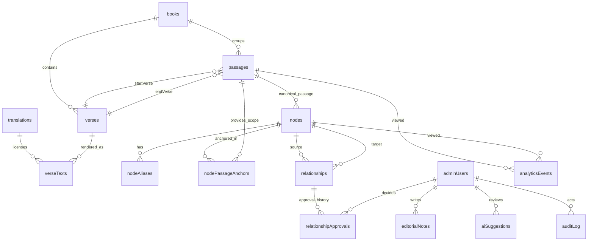

# DATA_MODELS.md

## Executive Summary

Repository-specific extraction is **pending** because no repository path, tree, schema files, migrations, or API specs were available in the current workspace; the only primary artifact available here is a user-provided design brief.[^scan-note] That brief narrows the target to a **Ruth-first MVP**, bounded cross-book stubs, explicit human approvals for public semantic relationships, internal-only AI suggestions, and **Convex-style document tables** rather than a graph database or generalized CMS.[^brief-grounding][^brief-structure]

Given those constraints, the safest starter shape is a **small document-table architecture** split into four bounded areas: scripture corpus, public semantic layer, editorial workflow, and operational analytics. Convex’s schema model already supports typed document tables, explicit table references through `v.id("table")`, optional fields through `v.optional(...)`, generated document IDs, and system creation timestamps, which is enough for this MVP when traversal is implemented through indexed relationship documents rather than graph-native storage. citeturn5view2turn5view4turn5view5turn3view6turn5view0

This file therefore does two jobs. First, it gives a **population template** for the eventual repository scan across JS/TS, Python, Go, Ruby, SQL, JSON Schema, OpenAPI, and protobuf sources. Second, it proposes a **conservative starter model** consistent with the available brief, while clearly marking unresolved items as assumptions rather than pretending certainty.[^brief-output]

## Source Status and Population Instructions

Use repository sources in this order when the actual tree is available: runtime schema code and migrations first, API/schema specs second, generated types third, Markdown docs fourth, and example payloads/tests last. If two sources disagree, the higher-priority source wins and the lower-priority source should be recorded under “Notes” or “Ambiguities,” not treated as authoritative.

| Source class | Typical locations to scan | What to extract |
|---|---|---|
| JS/TS schema and ORM code | `convex/schema.ts`, `**/*schema*.ts`, `**/*model*.ts`, `**/*entity*.ts`, `**/*types*.ts` | table names, validators, enums, refs, indexes, defaults, nullability |
| Python models | `**/models.py`, `**/*schema*.py`, `**/*pydantic*.py`, `**/*sqlalchemy*.py` | field types, validators, ORM relations, defaults |
| Go models | `**/*.go` with `struct`, `gorm`, `ent`, `sqlc` tags | field names, tags, nullability, table mappings |
| Ruby models and schema | `app/models/**/*.rb`, `db/schema.rb`, `db/migrate/*.rb` | associations, validations, indexes, migration history |
| SQL DDL and migrations | `db/**/*.sql`, `migrations/**/*.sql`, `schema.sql` | tables, constraints, foreign keys, indexes, defaults |
| JSON Schema | `**/*.schema.json`, `schemas/**/*.json` | required vs optional, allowed nulls, defaults, examples |
| OpenAPI | `openapi*.{yaml,yml,json}`, `spec/**/*.yaml` | component schemas, request/response models, read/write semantics |
| Protobuf | `**/*.proto` | message fields, cardinality, tag numbers, reserved fields, backward compatibility |
| Markdown and ADRs | `README.md`, `docs/**/*.md`, `ADR*.md`, `PRD.md`, `TECHNICAL_PLAN.md` | model intent, terminology, lifecycle rules, unresolved decisions |

When you populate the document from the real repo, use the following block once per discovered model:

```yaml
[[model_name]]:
  source_files:
    - [[path/to/file]]
  source_priority: [[runtime schema | migration | api schema | doc]]
  definition_kind: [[Convex table | SQL table | ORM model | JSON Schema | OpenAPI schema | Protobuf message | typed struct/class]]
  purpose: [[what this model represents]]
  ownership: [[bounded context / team / subsystem]]
  visibility: [[public | internal | mixed]]
  lifecycle:
    system_fields: [[_id, _creationTime, etc.]]
    app_fields: [[createdAt, updatedAt, deletedAt, publishedAt, etc.]]
  keys:
    primary: [[pk]]
    natural: [[slug / code / verseKey / tag number / none]]
  fields:
    [[fieldName]]:
      type: [[exact source type]]
      required: [[true/false]]
      nullable: [[true/false]]
      default: [[value or none]]
      constraints: [[enum/min/max/pattern/unique/fk/etc.]]
      indexes: [[participates in which indexes]]
      relations: [[1:1 / 1:N / N:M]]
  validation_rules:
    - [[cross-field or semantic invariants]]
  example_instances:
    json: [[...]]
    yaml: [[...]]
  migration_notes:
    - [[how this model evolves safely]]
  backward_compatibility:
    - [[what cannot change once published]]
  ambiguities:
    - [[missing in source or contradictory definitions]]
```

When extracting schema definitions from JSON Schema or OpenAPI, keep **presence**, **nullability**, and **default** distinct. In JSON Schema, a property can be listed under `properties` and still be optional unless it is also listed in `required`; `null` is a real value distinct from absence; and `default` is annotation metadata, not automatic value insertion during validation. OpenAPI 3.1 Schema Objects are a superset of JSON Schema Draft 2020-12, so the report should preserve both raw JSON Schema keywords and any OAS-specific annotations. citeturn2view0turn9view0turn8view0turn4view2

The current missing inputs and temporary assumptions are these:

| Missing or ambiguous input | Temporary assumption | Risk |
|---|---|---|
| Repository root/path | No concrete models can be extracted from code yet | High |
| `AGENTS.md` | Treat as absent, per request | Low |
| Filename mismatch | Use `DATA_MODELS.md`, though the available brief says `DATA_MODEL.md` | Low |
| Actual translation strategy | Use canonical `verses` plus translation-specific `verseTexts` | Medium |
| Need for standalone `chapters` table | Omit initially; derive chapter navigation from `verses` and `passages` | Medium |
| Need for standalone `themes` / `stubs` tables | Represent as `nodes.nodeType` values until repo proves separate tables are needed | Medium |
| Actual auth provider | Keep `adminUsers` minimal and provider-agnostic | Medium |
| Deletion policy | Soft-delete editorial/public content; append-only for approvals/audit; retention delete for analytics | Medium |

## Proposed MVP Model Inventory

The available brief suggests a small set of table areas but explicitly warns against over-normalizing or building a disguised graph database or generalized CMS.[^brief-structure][^brief-tables] The proposal below therefore keeps **themes** and **external stubs** as typed rows inside `nodes`, and keeps **chapter data** derived unless real repository code proves a separate table already exists.

| Table | Ownership | Visibility | Canonical key | Relations | Major indexes | Compatibility focus |
|---|---|---|---|---|---|---|
| `translations` | scripture | mixed | `key` | `1:N -> verseTexts` | `by_key`, `by_status` | license fields and translation key must remain stable |
| `books` | scripture | public | `canonKey`, `osisId` | `1:N -> verses`, `1:N -> passages` | `by_canonKey`, `by_osisId`, `by_sortOrder` | book identity must not drift |
| `verses` | scripture | public | `verseKey`, `osisRef` | `1:N -> verseTexts`, anchor target for passages | `by_verseKey`, `by_book_chapter_verse`, `by_osisRef` | verse identity is highest-stability key |
| `verseTexts` | scripture | public | `(verseId, translationId)` | `N:1 -> verses`, `N:1 -> translations` | `by_verse_translation`, `by_translation_verse` | preserve published text history and licensing |
| `passages` | scripture/editorial | public | `slug` | `N:1 -> books`, `N:1 -> verses(start/end)`, `1:N -> nodePassageAnchors` | `by_slug`, `by_book_startVerse`, `by_status` | public slugs and range semantics must stay stable |
| `nodes` | semantic | public | `slug` | `1:N -> nodeAliases`, `1:N -> relationships` | `by_slug`, `by_type`, `by_status`, `by_passageId` | slug and `nodeType` are durable public identity |
| `nodeAliases` | semantic | public | `(nodeId, normalizedAlias, locale)` | `N:1 -> nodes` | `by_node`, `by_normalizedAlias`, `by_primaryAlias` | aliases can grow; primary alias changes need care |
| `nodePassageAnchors` | semantic | public | compound | `N:1 -> nodes`, `N:1 -> passages`, optional verse refs | `by_node`, `by_passage`, `by_node_passage` | anchors should be additive and auditable |
| `relationships` | semantic | public | compound natural key + `_id` | `N:1 -> nodes(source/target)`, `1:N -> relationshipApprovals` | `by_source`, `by_target`, `by_source_status`, `by_target_status` | published relationship meaning must never shift silently |
| `relationshipApprovals` | editorial | internal | append-only `_id` | `N:1 -> relationships`, `N:1 -> adminUsers` | `by_relationship`, `by_decider`, `by_decision_date` | append-only approval history |
| `editorialNotes` | editorial | internal | `_id` | polymorphic target | `by_target`, `by_author`, `by_visibility` | internal-only; keep audit-safe |
| `aiSuggestions` | editorial/AI | internal | `_id` | optional trace to accepted public record | `by_type`, `by_reviewStatus`, `by_targetTable` | never public by direct promotion |
| `adminUsers` | auth/editorial | internal | `authSubject`, `email` | `1:N -> approvals/notes/audit` | `by_authSubject`, `by_email`, `by_role` | auth identity and role history |
| `auditLog` | platform | internal | append-only `_id` | actor/target refs | `by_target`, `by_actor`, `by_action`, `by_occurredAt` | append-only provenance |
| `analyticsEvents` | platform | internal/aggregated | `_id` | optional refs to passage/node | `by_eventName`, `by_sessionId`, `by_occurredAt`, `by_pageSlug` | version event payloads; avoid PII creep |

Convex already contributes `_id` and `_creationTime`; for application semantics, the mutable content tables should still carry explicit lifecycle fields such as `createdAt`, `updatedAt`, `deletedAt`, `publishedAt`, and editor provenance where needed. Optional fields should remain truly optional in the schema rather than overloaded as nullable unless null itself has business meaning. citeturn5view2turn5view4turn3view6

Use these shared enumerations unless the actual repository already defines stricter ones:

```ts
type WorkflowStatus =
  | "draft"
  | "suggested"
  | "approved"
  | "published"
  | "archived"
  | "rejected";

type NodeType =
  | "passage"
  | "person"
  | "place"
  | "group_lineage"
  | "thing_practice"
  | "theme_motif"
  | "external_stub";

type EvidenceClass = "textual" | "contextual" | "editorial";
type TranslationStatus = "active" | "disabled";
type AnchorKind = "primary" | "mention" | "context" | "background";
type SuggestionReviewStatus = "suggested" | "reviewed" | "accepted" | "rejected" | "expired";
type EditorialNoteType = "research" | "copyedit" | "licensing" | "approval" | "todo";
```

```yaml
# scripture corpus

translations:
  purpose: "Translation metadata and licensing boundary"
  ownership: "scripture"
  visibility: "mixed"
  keys: { primary: "_id", natural: "key" }
  fields:
    key: { type: "string", required: true, nullable: false, default: "none", constraints: ["immutable", "unique-by-mutation"] }
    name: { type: "string", required: true, nullable: false, default: "none" }
    languageCode: { type: "string", required: true, nullable: false, default: "en" }
    licenseName: { type: "string", required: true, nullable: false, default: "none" }
    licenseUrl: { type: "string", required: false, nullable: true, default: null }
    copyrightNotice: { type: "string", required: false, nullable: true, default: null }
    canPublishText: { type: "boolean", required: true, nullable: false, default: false }
    status: { type: "TranslationStatus", required: true, nullable: false, default: "active" }
  indexes: ["by_key(key)", "by_status(status)"]
  relations: ["1:N -> verseTexts.translationId"]
  migration_notes: ["Never repurpose a translation key", "Treat licensing changes as explicit history, not silent overwrite"]
  compatibility_focus: ["key", "licenseName", "canPublishText"]

books:
  purpose: "Canonical book identity and curation scope"
  ownership: "scripture"
  visibility: "public"
  keys: { primary: "_id", natural: ["canonKey", "osisId"] }
  fields:
    canonKey: { type: "string", required: true, nullable: false, default: "none", constraints: ["immutable", "unique-by-mutation"] }
    osisId: { type: "string", required: true, nullable: false, default: "none", constraints: ["immutable", "unique-by-mutation"] }
    displayName: { type: "string", required: true, nullable: false, default: "none" }
    chapterCount: { type: "number", required: true, nullable: false, default: "none", constraints: ["> 0"] }
    curatedScope: { type: '"full" | "stub" | "none"', required: true, nullable: false, default: '"none"' }
    sortOrder: { type: "number", required: true, nullable: false, default: "none" }
  indexes: ["by_canonKey(canonKey)", "by_osisId(osisId)", "by_sortOrder(sortOrder)"]
  relations: ["1:N -> verses.bookId", "1:N -> passages.bookId"]
  migration_notes: ["Do not change canon identity after public release", "Use new metadata fields rather than semantic redefinition"]
  compatibility_focus: ["canonKey", "osisId"]

verses:
  purpose: "Canonical verse identity independent of translation text"
  ownership: "scripture"
  visibility: "public"
  keys: { primary: "_id", natural: ["verseKey", "osisRef"] }
  fields:
    verseKey: { type: "string", required: true, nullable: false, default: "none", constraints: ["immutable", "unique-by-mutation", "e.g. ruth.1.16"] }
    osisRef: { type: "string", required: true, nullable: false, default: "none", constraints: ["immutable", "unique-by-mutation"] }
    bookId: { type: 'Id<"books">', required: true, nullable: false, default: "none", relations: ["N:1 -> books"] }
    chapterNumber: { type: "number", required: true, nullable: false, default: "none", constraints: ["> 0", "integer"] }
    verseNumber: { type: "number", required: true, nullable: false, default: "none", constraints: ["> 0", "integer"] }
  indexes: ["by_verseKey(verseKey)", "by_book_chapter_verse(bookId, chapterNumber, verseNumber)", "by_osisRef(osisRef)"]
  relations: ["1:N -> verseTexts.verseId", "target for passages.startVerseId/endVerseId"]
  migration_notes: ["Never renumber verseKey", "If textual segmentation changes later, version the rendering layer rather than the canonical verse identity"]
  compatibility_focus: ["verseKey", "osisRef", "bookId/chapterNumber/verseNumber"]

verseTexts:
  purpose: "Translation-specific verse rendering and text publication boundary"
  ownership: "scripture"
  visibility: "public"
  keys: { primary: "_id", natural: ["verseId", "translationId"] }
  fields:
    verseId: { type: 'Id<"verses">', required: true, nullable: false, default: "none", relations: ["N:1 -> verses"] }
    translationId: { type: 'Id<"translations">', required: true, nullable: false, default: "none", relations: ["N:1 -> translations"] }
    text: { type: "string", required: true, nullable: false, default: "none" }
    textVersion: { type: "string", required: false, nullable: true, default: null }
    licenseSnapshot: { type: "string", required: false, nullable: true, default: null }
    checksum: { type: "string", required: false, nullable: true, default: null }
    status: { type: "TranslationStatus", required: true, nullable: false, default: "active" }
  indexes: ["by_verse_translation(verseId, translationId)", "by_translation_verse(translationId, verseId)"]
  relations: ["N:1 -> verses", "N:1 -> translations"]
  migration_notes: ["Add a new row for new translation/version instead of mutating canonical identity", "Preserve publishable text audit trail"]
  compatibility_focus: ["verseId+translationId", "textVersion", "licenseSnapshot"]

passages:
  purpose: "Curated passage ranges and stable public URLs"
  ownership: "scripture/editorial"
  visibility: "public"
  keys: { primary: "_id", natural: "slug" }
  fields:
    slug: { type: "string", required: true, nullable: false, default: "none", constraints: ["immutable-after-publish", "unique-by-mutation"] }
    title: { type: "string", required: true, nullable: false, default: "none" }
    summary: { type: "string", required: false, nullable: true, default: null }
    bookId: { type: 'Id<"books">', required: true, nullable: false, default: "none" }
    startVerseId: { type: 'Id<"verses">', required: true, nullable: false, default: "none" }
    endVerseId: { type: 'Id<"verses">', required: true, nullable: false, default: "none" }
    status: { type: "WorkflowStatus", required: true, nullable: false, default: "draft" }
    publishedAt: { type: "number", required: false, nullable: true, default: null }
  indexes: ["by_slug(slug)", "by_book_startVerse(bookId, startVerseId)", "by_status(status)"]
  relations: ["N:1 -> books", "N:1 -> verses(start/end)", "1:N -> nodePassageAnchors", "optional 1:1 <- nodes when nodeType=passage"]
  migration_notes: ["If a published slug must change, preserve redirect metadata in app layer", "If boundaries change materially, consider new passage version instead of silent rewrite"]
  compatibility_focus: ["slug", "startVerseId", "endVerseId", "status"]
```

```yaml
# public semantic layer

nodes:
  purpose: "Public semantic nodes for passage/entity/theme/stub concepts"
  ownership: "semantic"
  visibility: "public"
  keys: { primary: "_id", natural: "slug" }
  fields:
    slug: { type: "string", required: true, nullable: false, default: "none", constraints: ["immutable-after-publish", "unique-by-mutation"] }
    nodeType: { type: "NodeType", required: true, nullable: false, default: "none" }
    displayName: { type: "string", required: true, nullable: false, default: "none" }
    shortLabel: { type: "string", required: false, nullable: true, default: null }
    summary: { type: "string", required: false, nullable: true, default: null }
    passageId: { type: 'Id<"passages">', required: false, nullable: true, default: null, constraints: ["required when nodeType=passage", "forbidden otherwise unless repo proves reuse"] }
    status: { type: "WorkflowStatus", required: true, nullable: false, default: "draft" }
    isPublic: { type: "boolean", required: true, nullable: false, default: false }
    publishedAt: { type: "number", required: false, nullable: true, default: null }
  indexes: ["by_slug(slug)", "by_type(nodeType)", "by_status(status)", "by_passageId(passageId)"]
  relations: ["1:N -> nodeAliases", "1:N -> nodePassageAnchors", "1:N -> relationships as source", "1:N -> relationships as target"]
  migration_notes: ["Do not silently change nodeType for published records", "Prefer additive metadata to identity rewrite"]
  compatibility_focus: ["slug", "nodeType", "passageId"]

nodeAliases:
  purpose: "Alternative names and search/display aliases for nodes"
  ownership: "semantic"
  visibility: "public"
  keys: { primary: "_id", natural: ["nodeId", "normalizedAlias", "locale"] }
  fields:
    nodeId: { type: 'Id<"nodes">', required: true, nullable: false, default: "none" }
    alias: { type: "string", required: true, nullable: false, default: "none" }
    normalizedAlias: { type: "string", required: true, nullable: false, default: "none", constraints: ["normalized", "unique-per-node-locale"] }
    locale: { type: "string", required: true, nullable: false, default: "en-US" }
    aliasType: { type: '"display" | "alternate" | "transliteration" | "search"', required: true, nullable: false, default: '"alternate"' }
    isPrimary: { type: "boolean", required: true, nullable: false, default: false }
  indexes: ["by_node(nodeId)", "by_normalizedAlias(normalizedAlias)", "by_primaryAlias(nodeId, locale, isPrimary)"]
  relations: ["N:1 -> nodes"]
  migration_notes: ["Add aliases freely, but protect the primary alias path once public", "Retain historical aliases if links or editorial references depend on them"]
  compatibility_focus: ["normalizedAlias", "isPrimary"]

nodePassageAnchors:
  purpose: "Bounded attachment of a node to one or more passages or verse spans"
  ownership: "semantic"
  visibility: "public"
  keys: { primary: "_id", natural: ["nodeId", "passageId", "anchorKind", "startVerseId", "endVerseId"] }
  fields:
    nodeId: { type: 'Id<"nodes">', required: true, nullable: false, default: "none" }
    passageId: { type: 'Id<"passages">', required: true, nullable: false, default: "none" }
    startVerseId: { type: 'Id<"verses">', required: false, nullable: true, default: null }
    endVerseId: { type: 'Id<"verses">', required: false, nullable: true, default: null }
    anchorKind: { type: "AnchorKind", required: true, nullable: false, default: "context" }
    strength: { type: "number", required: false, nullable: true, default: null, constraints: ["1..5 if used"] }
  indexes: ["by_node(nodeId)", "by_passage(passageId)", "by_node_passage(nodeId, passageId)"]
  relations: ["N:1 -> nodes", "N:1 -> passages", "optional N:1 -> verses(start/end)"]
  migration_notes: ["Prefer new anchor rows over silent reuse when editorial stance changes", "Track major anchor changes in audit log"]
  compatibility_focus: ["nodeId", "passageId", "anchorKind"]

relationships:
  purpose: "Explicit, curated semantic relationships suitable for public traversal"
  ownership: "semantic"
  visibility: "public"
  keys: { primary: "_id", natural: ["sourceNodeId", "targetNodeId", "relationshipTypeKey", "evidenceClass"] }
  fields:
    sourceNodeId: { type: 'Id<"nodes">', required: true, nullable: false, default: "none" }
    targetNodeId: { type: 'Id<"nodes">', required: true, nullable: false, default: "none" }
    relationshipTypeKey: { type: "string", required: true, nullable: false, default: "none", constraints: ["enum-in-code-once-defined"] }
    evidenceClass: { type: "EvidenceClass", required: true, nullable: false, default: "textual" }
    publicLabel: { type: "string", required: true, nullable: false, default: "none" }
    rationale: { type: "string", required: true, nullable: false, default: "none" }
    sourcePassageId: { type: 'Id<"passages">', required: false, nullable: true, default: null }
    targetPassageId: { type: 'Id<"passages">', required: false, nullable: true, default: null }
    approvalStatus: { type: "WorkflowStatus", required: true, nullable: false, default: "draft" }
    currentApprovalId: { type: 'Id<"relationshipApprovals">', required: false, nullable: true, default: null }
    isPublic: { type: "boolean", required: true, nullable: false, default: false }
    publishedAt: { type: "number", required: false, nullable: true, default: null }
  indexes: ["by_source(sourceNodeId)", "by_target(targetNodeId)", "by_source_status(sourceNodeId, approvalStatus)", "by_target_status(targetNodeId, approvalStatus)"]
  relations: ["N:1 -> nodes (source/target)", "1:N -> relationshipApprovals"]
  migration_notes: ["Never change the meaning of a published relationship in place without new approval history", "Avoid reusing relationshipTypeKey for semantically different concepts"]
  compatibility_focus: ["sourceNodeId", "targetNodeId", "relationshipTypeKey", "evidenceClass", "currentApprovalId"]

relationshipApprovals:
  purpose: "Human approval and rejection history for public semantic relationships"
  ownership: "editorial"
  visibility: "internal"
  keys: { primary: "_id", natural: "append-only" }
  fields:
    relationshipId: { type: 'Id<"relationships">', required: true, nullable: false, default: "none" }
    decision: { type: '"approved" | "rejected" | "revoked"', required: true, nullable: false, default: "approved" }
    decidedByAdminUserId: { type: 'Id<"adminUsers">', required: true, nullable: false, default: "none" }
    decidedAt: { type: "number", required: true, nullable: false, default: "none" }
    rationale: { type: "string", required: true, nullable: false, default: "none" }
    evidenceSummary: { type: "string", required: false, nullable: true, default: null }
    version: { type: "number", required: true, nullable: false, default: 1, constraints: [">=1", "monotonic per relationship"] }
    supersedesApprovalId: { type: 'Id<"relationshipApprovals">', required: false, nullable: true, default: null }
  indexes: ["by_relationship(relationshipId)", "by_decider(decidedByAdminUserId)", "by_decision_date(decision, decidedAt)"]
  relations: ["N:1 -> relationships", "N:1 -> adminUsers", "optional self-reference supersession"]
  migration_notes: ["Append-only; do not mutate old approval decisions except for explicit redaction policy", "Use supersession rather than overwrite"]
  compatibility_focus: ["relationshipId", "decision", "version"]
```

```yaml
# editorial and operations

editorialNotes:
  purpose: "Internal notes attached to passages, nodes, relationships, or AI suggestions"
  ownership: "editorial"
  visibility: "internal"
  keys: { primary: "_id", natural: "none" }
  fields:
    targetTable: { type: "string", required: true, nullable: false, default: "none" }
    targetId: { type: "string", required: true, nullable: false, default: "none" }
    noteType: { type: "EditorialNoteType", required: true, nullable: false, default: "research" }
    body: { type: "string", required: true, nullable: false, default: "none" }
    visibility: { type: '"internal" | "approval_packet"', required: true, nullable: false, default: '"internal"' }
    authorAdminUserId: { type: 'Id<"adminUsers">', required: true, nullable: false, default: "none" }
  indexes: ["by_target(targetTable, targetId)", "by_author(authorAdminUserId)", "by_visibility(visibility)"]
  relations: ["polymorphic target", "N:1 -> adminUsers"]
  migration_notes: ["Keep internals internal; do not expose directly in public payloads"]
  compatibility_focus: ["targetTable", "targetId"]

aiSuggestions:
  purpose: "Internal AI-generated candidates that never publish directly"
  ownership: "editorial/AI"
  visibility: "internal"
  keys: { primary: "_id", natural: "none" }
  fields:
    suggestionType: { type: '"node" | "relationship" | "alias" | "anchor" | "theme"', required: true, nullable: false, default: "none" }
    targetTable: { type: "string", required: false, nullable: true, default: null }
    candidatePayload: { type: "Record<string, unknown>", required: true, nullable: false, default: "none" }
    modelProvider: { type: "string", required: true, nullable: false, default: "none" }
    modelName: { type: "string", required: true, nullable: false, default: "none" }
    promptVersion: { type: "string", required: true, nullable: false, default: "none" }
    sourceRefKeys: { type: "string[]", required: true, nullable: false, default: "[]" }
    confidenceScore: { type: "number", required: false, nullable: true, default: null, constraints: ["0..1 if used"] }
    reviewStatus: { type: "SuggestionReviewStatus", required: true, nullable: false, default: "suggested" }
    reviewedByAdminUserId: { type: 'Id<"adminUsers">', required: false, nullable: true, default: null }
    reviewedAt: { type: "number", required: false, nullable: true, default: null }
    derivedRecordTable: { type: "string", required: false, nullable: true, default: null }
    derivedRecordId: { type: "string", required: false, nullable: true, default: null }
    publishBlocked: { type: "boolean", required: true, nullable: false, default: true }
  indexes: ["by_type(suggestionType)", "by_reviewStatus(reviewStatus)", "by_targetTable(targetTable)"]
  relations: ["optional trace to accepted public record", "N:1 -> adminUsers (reviewer)"]
  migration_notes: ["Internal schema may evolve more freely than public tables", "Never allow direct public reads from this table"]
  compatibility_focus: ["publishBlocked", "reviewStatus", "derivedRecordTable/derivedRecordId"]

adminUsers:
  purpose: "Editorial/admin identity and authorization"
  ownership: "auth/editorial"
  visibility: "internal"
  keys: { primary: "_id", natural: ["authSubject", "email"] }
  fields:
    authSubject: { type: "string", required: true, nullable: false, default: "none", constraints: ["unique-by-mutation"] }
    email: { type: "string", required: true, nullable: false, default: "none", constraints: ["unique-by-mutation"] }
    displayName: { type: "string", required: true, nullable: false, default: "none" }
    role: { type: '"editor" | "reviewer" | "admin"', required: true, nullable: false, default: '"editor"' }
    status: { type: '"active" | "disabled"', required: true, nullable: false, default: '"active"' }
  indexes: ["by_authSubject(authSubject)", "by_email(email)", "by_role(role)"]
  relations: ["1:N -> approvals", "1:N -> notes", "1:N -> auditLog"]
  migration_notes: ["Never reuse authSubject", "Prefer role expansion over role renaming"]
  compatibility_focus: ["authSubject", "role", "status"]

auditLog:
  purpose: "Append-only provenance for sensitive changes"
  ownership: "platform"
  visibility: "internal"
  keys: { primary: "_id", natural: "append-only" }
  fields:
    actorType: { type: '"admin" | "system" | "ai"', required: true, nullable: false, default: '"system"' }
    actorAdminUserId: { type: 'Id<"adminUsers">', required: false, nullable: true, default: null }
    action: { type: "string", required: true, nullable: false, default: "none" }
    targetTable: { type: "string", required: true, nullable: false, default: "none" }
    targetId: { type: "string", required: true, nullable: false, default: "none" }
    before: { type: "Record<string, unknown>", required: false, nullable: true, default: null }
    after: { type: "Record<string, unknown>", required: false, nullable: true, default: null }
    requestId: { type: "string", required: false, nullable: true, default: null }
    occurredAt: { type: "number", required: true, nullable: false, default: "none" }
  indexes: ["by_target(targetTable, targetId)", "by_actor(actorAdminUserId)", "by_action(action)", "by_occurredAt(occurredAt)"]
  relations: ["optional N:1 -> adminUsers"]
  migration_notes: ["Append-only", "Redaction, if ever needed, should be policy-driven and exceptional"]
  compatibility_focus: ["action", "targetTable", "targetId", "occurredAt"]

analyticsEvents:
  purpose: "Operational reader analytics with bounded payloads"
  ownership: "platform"
  visibility: "internal / aggregated"
  keys: { primary: "_id", natural: "none" }
  fields:
    eventName: { type: "string", required: true, nullable: false, default: "none" }
    occurredAt: { type: "number", required: true, nullable: false, default: "none" }
    sessionId: { type: "string", required: true, nullable: false, default: "none" }
    anonymousUserId: { type: "string", required: false, nullable: true, default: null }
    pageSlug: { type: "string", required: false, nullable: true, default: null }
    passageId: { type: 'Id<"passages">', required: false, nullable: true, default: null }
    nodeId: { type: 'Id<"nodes">', required: false, nullable: true, default: null }
    metadata: { type: "Record<string, unknown>", required: false, nullable: true, default: null }
    payloadVersion: { type: "number", required: true, nullable: false, default: 1 }
  indexes: ["by_eventName(eventName)", "by_sessionId(sessionId)", "by_occurredAt(occurredAt)", "by_pageSlug(pageSlug)"]
  relations: ["optional N:1 -> passages", "optional N:1 -> nodes"]
  migration_notes: ["Version event payloads", "Use retention/aggregation instead of long-lived raw sprawl"]
  compatibility_focus: ["eventName", "payloadVersion"]
```

## Relationship Map and Example Instances

The entity map below reflects the **starter proposal** inferred from the available brief, not a completed repository extraction.[^scan-note]



Public reader queries should be allowed to touch only the published surface: `books`, `verses`, `verseTexts`, `passages`, `nodes`, `nodeAliases`, `nodePassageAnchors`, and `relationships` that are both published and backed by a human approval record. Editorial queries may union that public surface with `relationshipApprovals`, `editorialNotes`, `aiSuggestions`, `adminUsers`, `auditLog`, and draft rows. That is how the model can support semantic traversal without becoming a whole-Bible graph engine: traversal is bounded by curated nodes, explicit edges, and passage anchors rather than open-ended graph expansion.[^brief-grounding][^brief-structure]

| Table | Public read path | Internal-only fields/tables involved | Approval gate | Delete policy |
|---|---|---|---|---|
| `verseTexts` | Yes | licensing metadata may be partially internal | translation must be publishable | disable/archive, avoid hard delete |
| `passages` | Yes | editorial notes/audit | `status=published` | archive preferred over delete |
| `nodes` | Yes | editorial notes/audit | `status=published` and `isPublic=true` | archive preferred over delete |
| `relationships` | Yes | approvals, audit | `currentApprovalId != null`, `approvalStatus=published`, `isPublic=true` | archive preferred over delete |
| `relationshipApprovals` | No | full record internal | N/A | append-only |
| `aiSuggestions` | No | full record internal | cannot publish directly | retain or expire |
| `auditLog` | No | full record internal | N/A | append-only |
| `analyticsEvents` | No direct raw exposure | aggregation only | N/A | retention delete |

Example public and internal instances should look like this:

```json
{
  "translation": {
    "key": "NRSVUE",
    "name": "New Revised Standard Version, Updated Edition",
    "languageCode": "en",
    "licenseName": "Example License Placeholder",
    "canPublishText": true,
    "status": "active"
  },
  "verse": {
    "verseKey": "ruth.1.16",
    "osisRef": "Ruth.1.16",
    "bookId": "books_ruth",
    "chapterNumber": 1,
    "verseNumber": 16
  },
  "verseText": {
    "verseId": "verses_ruth_1_16",
    "translationId": "translations_nrsvue",
    "text": "But Ruth said, \"Do not press me to leave you...\"",
    "status": "active"
  },
  "passage": {
    "slug": "ruth-1-16-17",
    "title": "Ruth Clings to Naomi",
    "bookId": "books_ruth",
    "startVerseId": "verses_ruth_1_16",
    "endVerseId": "verses_ruth_1_17",
    "status": "published"
  },
  "node": {
    "slug": "naomi",
    "nodeType": "person",
    "displayName": "Naomi",
    "status": "published",
    "isPublic": true
  }
}
```

```yaml
relationship:
  sourceNodeId: nodes_ruth
  targetNodeId: nodes_naomi
  relationshipTypeKey: covenant_loyalty_to
  evidenceClass: textual
  publicLabel: loyal to
  rationale: >
    Editorially approved because the passage text explicitly frames Ruth's
    commitment in covenantally weighty language.
  sourcePassageId: passages_ruth_1_16_17
  approvalStatus: published
  currentApprovalId: relationshipApprovals_rel_001_v1
  isPublic: true

relationshipApproval:
  relationshipId: relationships_rel_001
  decision: approved
  decidedByAdminUserId: adminUsers_editor_001
  decidedAt: 1779417600000
  rationale: Textual basis is explicit and public label is restrained.
  version: 1

aiSuggestion:
  suggestionType: relationship
  candidatePayload:
    sourceNodeSlug: ruth
    targetNodeSlug: bethlehem
    relationshipTypeKey: journeys_to
  modelProvider: openai
  modelName: example-model
  promptVersion: rel-suggest-v1
  sourceRefKeys: ["ruth.1.19", "ruth.1.22"]
  reviewStatus: suggested
  publishBlocked: true
```

## Conventions, Validation, and Query Rules

Use **plural table names**, **camelCase field names** for Convex/TypeScript code, **kebab-case** for public slugs, and a **lowercase dotted canonical key** for verse identity, such as `ruth.1.16`. Convex document `_id` values are still useful for joins and mutations, but the stable public contract should be the natural key (`slug`, `verseKey`, `osisRef`, `translation.key`) rather than the storage-local ID. Convex document IDs are system-generated and globally unique at runtime, which supports this split between internal reference identity and public canonical identity. citeturn3view6

Validation rules must be documented in the same idiom as the source. For Convex, note whether a field is `v.optional`, `v.union(..., v.null())`, or a typed reference with `v.id("table")`; these distinctions matter both for insert-time validation and for safe staged creation of linked documents. Because Convex schema validation runs on `db.insert`, `db.replace`, and `db.patch`, any true cycle should either leave one side nullable or be created in multiple steps. citeturn5view4turn5view5turn5view0

If the repository contains JSON Schema or OpenAPI, document required fields, nullable fields, defaults, examples, and `readOnly`/`writeOnly`/`deprecated` annotations exactly as the source defines them, rather than translating them into hand-wavy prose. JSON Schema’s `default` and `examples` are documentation annotations rather than validation behavior, and OpenAPI 3.1 inherits JSON Schema Draft 2020-12 semantics while adding OAS-specific vocabulary. citeturn8view0turn4view2

The most important cross-model invariants for this MVP are these:

| Invariant | Applies to | Enforcement recommendation |
|---|---|---|
| `verseKey` and `osisRef` are immutable | `verses` | reject updates after creation |
| public `slug` is never silently reused | `passages`, `nodes` | mutation guard + reserved slug registry in app layer if needed |
| `startVerseId` must precede or equal `endVerseId` and remain in the same book unless explicitly allowed later | `passages` | mutation validation |
| `nodeType="passage"` requires `passageId`; non-passage nodes should not point at `passageId` unless repository code proves a broader pattern | `nodes` | mutation validation |
| only one primary alias per `(nodeId, locale)` | `nodeAliases` | mutation validation |
| `relationships.isPublic=true` requires `currentApprovalId != null` and `approvalStatus="published"` | `relationships` | mutation validation + query filter |
| `aiSuggestions` must never appear in public reader queries | `aiSuggestions` | separate query surface |
| approval history is append-only | `relationshipApprovals` | no destructive updates |
| audit history is append-only | `auditLog` | no destructive updates |
| analytics payloads must stay bounded and versioned | `analyticsEvents` | event contract versioning |

Public reader query flow should be predictable and calm: resolve a `passage.slug` or `node.slug`, fetch the published event horizon around that object, hydrate only published/approved related records, then resolve verse text for the chosen translation. Editorial query flow can be broader and status-aware: include drafts, suggested AI rows, approvals, notes, and audit history. That separation is what protects trust and keeps the public layer restrained enough to support accessible UI behavior rather than volatile state soup.[^brief-grounding][^brief-structure]

## Migration, Compatibility, and Open Questions

Adopt **additive-first migrations** across the board. Add a nullable or optional field first, backfill it, update readers, then tighten validation only after all producers and consumers are ready. For public content, changing identity-bearing fields such as `verseKey`, `osisRef`, `slug`, `nodeType`, or `relationshipTypeKey` should be treated as a versioning event, not a casual edit.

If SQL migrations appear in the repository, record every index predicate, uniqueness detail, and whether large production indexes are created with `CONCURRENTLY`. In PostgreSQL, concurrent index creation avoids blocking writers but takes longer, requires more work, and can leave behind an invalid index on failure, so that operational context belongs in the model doc. citeturn11view0

If `.proto` files appear, document field numbers, cardinality, and reserved ranges exactly. Protobuf recommends `optional` over implicit scalar presence, warns that field numbers must never be reused, requires deleted field numbers and names to be reserved, and distinguishes genuinely wire-safe changes from merely wire-compatible ones that may still be lossy in practice. citeturn10view2turn4view4turn4view6turn10view0

Use these open items as the handoff list for the real repository scan:

| Open question | Why it matters | Temporary answer here |
|---|---|---|
| Does the repo already define `convex/schema.ts` and exact table names? | Determines whether this proposal matches code reality | Unknown; proposal only |
| Is Bible text stored in a single translation or already normalized by translation? | Changes whether `verseTexts` is needed | Assume normalized text layer |
| Are `themes` and `stubs` already standalone tables? | Affects whether `nodes.nodeType` is enough | Assume typed nodes |
| Is there a `chapters` table in code or only chapter numbers on verses? | Affects navigation/query shape | Assume derived chapters |
| What are the canonical relationship types? | Needed for strong enums and compatibility rules | Keep `relationshipTypeKey` string until repo defines enum |
| Which auth system backs editorial users? | Affects `adminUsers.authSubject` and migration notes | Keep provider-agnostic |
| Are soft deletes required for public content, or is `archived` sufficient? | Affects lifecycle and audit behavior | Prefer `archived`; keep `deletedAt` optional |
| Does the repository expose OpenAPI, JSON Schema, or protobuf contracts? | Needed for API-facing model extraction | Unknown until scan |
| Are there existing SQL migrations or only Convex state? | Changes how indexes and constraints are documented | Unknown until scan |
| Should filename align with `DATA_MODEL.md` or `DATA_MODELS.md`? | Prevents doc drift | Current file uses `DATA_MODELS.md`[^filename] |

[^brief-grounding]: User-provided project brief in `/mnt/data/Pasted text.txt`, lines 14–29.
[^brief-structure]: User-provided project brief in `/mnt/data/Pasted text.txt`, lines 35–64 and 66–90.
[^brief-tables]: User-provided project brief in `/mnt/data/Pasted text.txt`, lines 91–120.
[^brief-output]: User-provided project brief in `/mnt/data/Pasted text.txt`, lines 134–140.
[^scan-note]: Workspace inspection for this task found only `/mnt/data/Pasted text.txt`; no repository checkout, code schema files, migrations, or API specification files were present to inspect directly.
[^filename]: The available brief names the file `DATA_MODEL.md`, while the current task requests `DATA_MODELS.md`; this document follows the current task name.