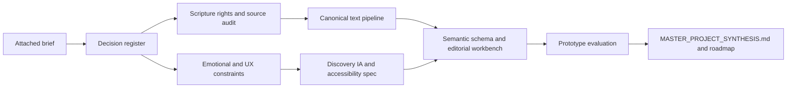
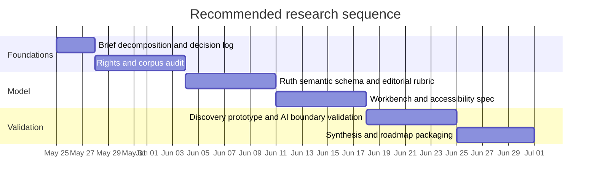

# Deep Research Report on the Attached Semantic Scripture Project Brief

## Executive summary

The attached text is not a generic product prompt. It is a tightly bounded project constitution for a **handcrafted semantic Scripture exploration environment** in the SethBuilds portfolio. It explicitly rejects nearby categories such as an AI Bible chatbot, sermon generator, productivity tool, church-management system, enterprise Bible platform, or “Christian SaaS,” and instead defines a Ruth-first experience centered on curiosity, discovery, delight, and relational exploration within Scripture. fileciteturn0file0L3-L16 fileciteturn0file0L18-L39 fileciteturn0file0L41-L63

Structurally, the brief combines six things at once: a vision statement, a scope-control memo, an emotional/UX manifesto, an editorial governance charter, an architecture constraint set, and an output specification for a future `MASTER_PROJECT_SYNTHESIS.md`. Its intended audience is therefore mixed: the founder’s future self, future collaborators/editors, and implementation agents such as Codex or similar coding assistants, since the brief explicitly says the future document should optimize for implementation guidance, architectural grounding, emotional continuity, and prevention of scope drift. fileciteturn0file0L133-L168 fileciteturn0file0L170-L206

The attached brief should be researched as an **exploratory-search and editorial-craft problem**, not as an LLM feature ideation problem. That framing is well supported by information-retrieval literature: exploratory search is distinguished from simple lookup because it is open-ended, iterative, and learning-oriented, while information-foraging and sensemaking research emphasizes navigation via connected cues and the progressive narrowing and exploitation of promising information paths. Those models closely match the brief’s language of “semantic wandering,” “Wikipedia-style exploration,” and the Ruth-centered “magic moment” of clicking into people, places, and things to discover living pathways across Scripture. fileciteturn0file0L33-L39 fileciteturn0file0L160-L168 citeturn3search4turn6search0turn9view12turn9view13

The highest-confidence research priorities are therefore: deciding the Scripture text and rights posture; defining a Ruth-first semantic schema plus editorial rubric; designing the curation workbench as core infrastructure; grounding the interface in WCAG/APG-aligned keyboard, focus, and target-size practices; and operationalizing AI as a suggestion-only layer with mandatory human approval. The biggest unresolved risks are translation/licensing, the still-vague meaning of “objective and restrained” semantics, the absence of measurable success criteria for the “magic moment,” and the lack of a concrete accessibility testing plan. fileciteturn0file0L81-L114 fileciteturn0file0L116-L168 citeturn9view0turn9view1turn9view2turn9view4turn10view1turn10view3turn14view0turn9view17turn9view18turn9view19turn9view20

## Reading of the attached brief

The brief’s shape, goals, constraints, tone, and audience are unusually explicit. The table below captures the most important analytic reading.

| Dimension | Analytical reading | Evidence |
|---|---|---|
| Structure | Hybrid of manifesto, scope memo, architecture brief, editorial charter, and prompt for a future synthesis document. | The text moves from mission and anti-goals to emotional identity, MVP scope, semantic rules, AI constraints, accessibility, stack, architecture, and the requested final document. fileciteturn0file0L3-L206 |
| Core goal | Create a delight-driven, exploratory Scripture experience that helps users discover Biblical connectedness through curiosity rather than through Q&A or task completion. | Mission, emotional qualities, and product-feel clauses all point in this direction. fileciteturn0file0L14-L39 fileciteturn0file0L160-L168 |
| Scope constraints | The MVP is intentionally small, begins with Ruth, may include only a few “semantic stubs” elsewhere, and must avoid theology generation, doctrinal synthesis, social features, CMS abstraction, plugin ecosystems, and premature graph/enterprise complexity. | Ruth-first scope, anti-goals, and avoid lists are explicit. fileciteturn0file0L41-L63 fileciteturn0file0L124-L131 |
| Semantic philosophy | Initial semantics should be objective, lightweight, and centered on people, places, objects, cross-references, and restrained themes, with human approval for every published relationship. | Semantic priorities and approval rules are explicit. fileciteturn0file0L65-L102 |
| Tone | Thoughtful, clear, grounded, inspiring without hype, serious but approachable, emotionally resonant without becoming flowery, and explicitly hostile to startup jargon. | The requested tone is enumerated directly. fileciteturn0file0L189-L198 |
| Intended audience | Primary: founder/future self. Secondary: implementation agents and future collaborators. Tertiary: portfolio viewers who will experience the product as evidence of craft. | “SethBuilds portfolio” establishes public-facing craft value, while “future implementation guidance,” “Codex architectural grounding,” and “preventing scope drift” identify future builders as audiences. fileciteturn0file0L3-L3 fileciteturn0file0L200-L206 |

Two interpretive conclusions matter for the rest of the research plan. First, the brief defines identity through **exclusions** almost as strongly as through aspirations. In other words, the anti-goals are not decorative; they are first-class requirements. Any future synthesis that “solves” the wrong problem would fail even if it were technically elegant. fileciteturn0file0L5-L12 fileciteturn0file0L57-L63 fileciteturn0file0L124-L131

Second, the brief is best understood as an **exploratory navigation system** rather than a search engine or chatbot. Marchionini’s framing of exploratory search as open-ended, iterative, and learning-oriented, together with Pirolli and Card’s account of information foraging and narrowing/exploiting promising information patches, matches the brief’s explicit preference for being “traversable rather than searchable” and for enabling discovery by following semantically meaningful clues. In Tolkien terms, it wants a curated library and a map of paths, not a Palantír that claims to answer everything. fileciteturn0file0L33-L39 fileciteturn0file0L160-L168 citeturn3search4turn6search0turn9view12turn9view13

A further architectural reading is that the chosen stack is not accidental. The brief’s “handcrafted rather than corporate” posture aligns well with shadcn/ui’s “open code” model for building one’s own design system, Radix’s investment in focus management and keyboard navigation, Tailwind’s responsive utility approach, Next.js’s full-stack App Router, and Convex’s document-relational JSON model. Taken together, these choices support a restrained custom build rather than an overgeneralized platform. fileciteturn0file0L116-L158 fileciteturn0file0L160-L165 citeturn9view8turn9view9turn9view10turn18view2turn9view24

## Research questions, hypotheses, and deliverables

The brief contains both **explicit** research questions and **implicit** ones. The explicit questions are disguised as imperatives about what the future synthesis document must define; the implicit questions arise where the brief sets values or constraints without operational criteria. The table below extracts the key ones.

| Research question | Explicit or inferred | Working hypothesis | Required deliverable |
|---|---|---|---|
| What is the core interaction paradigm? | Explicit. The product should be “traversable rather than searchable.” | A discovery-first interface organized around semantically meaningful entities and paths will better realize the brief than a query box or chatbot shell. fileciteturn0file0L160-L168 citeturn3search4turn6search0turn9view12turn9view13 | A navigation and information-architecture spec for Ruth-centered exploration. |
| What belongs in the MVP? | Explicit. The MVP is small and Ruth-first, with limited stubs elsewhere. | A tightly curated Ruth corpus plus a small number of bridge nodes from Matthew 1, David, Bethlehem, gleaning laws, and Moab is enough to evoke a larger Scriptural world without scope explosion. fileciteturn0file0L41-L63 | An MVP inclusion matrix and stub-content list. |
| What semantic units matter first? | Explicit. People, places, objects, cross-references, and lightweight themes are named. | These five primitives are sufficient to create meaningful exploratory depth without early ontology bloat. fileciteturn0file0L65-L79 | A semantic schema and controlled vocabulary draft. |
| How should “objective and restrained” be operationalized? | Inferred. The brief states the value but not the rule system. | Objective MVP semantics should privilege explicit textual, genealogical, geographic, legal/custom, and narrative links before interpretive/doctrinal links. fileciteturn0file0L81-L83 | An editorial style guide with evidence classes and publication rules. |
| Which Bible text source and licensing path should be used? | Inferred. The brief separates immutable Scripture text from overlays but does not pick a translation or rights model. | An open/public-domain source may accelerate MVP, but a licensed modern translation may better fit the project’s tonal and ecclesial ambitions; the choice is strategic, legal, and experiential. fileciteturn0file0L152-L158 citeturn14view0turn9view17turn9view18turn9view19turn9view20 | A licensing memo and source-selection decision. |
| What is AI allowed to do? | Explicit. AI may suggest; it may not publish theology or hidden relations. | Suggestion-only AI with visible provenance and mandatory editorial approval is the highest-alignment pattern. fileciteturn0file0L85-L102 citeturn10view1turn10view3turn10view4turn10view2 | An AI-use policy plus suggestion-review queue design. |
| What makes the editorial workbench successful? | Explicit. Keyboard speed, low cognitive load, minimal friction, and accessibility are named. | The internal workbench is at least as important as the reader surface; weak editorial tooling will slowly deform the product’s semantic quality and emotional coherence. fileciteturn0file0L133-L150 | A workbench workflow spec and task model. |
| What accessibility baseline is required? | Explicit in principle, under-specified in standard terms. | WCAG/APG-aligned focus order, predictable focus behavior, keyboard operability, and adequately sized touch targets are the right MVP baseline for the brief’s “accessible enough” posture. fileciteturn0file0L104-L114 citeturn9view0turn9view1turn9view2turn9view4turn9view9 | An accessibility acceptance checklist and test plan. |
| How will success be measured? | Inferred. The brief supplies a “magic moment” but not metrics. | Success should be measured by discovery depth, clarity, delight, editorial throughput, and AI-suggestion precision rather than by raw search volume or content generation. fileciteturn0file0L167-L168 citeturn3search4turn9view12turn9view13 | A lightweight evaluation framework with product and editorial metrics. |

The brief also implies a higher-order hypothesis: **semantic exploration is not merely a feature choice but the product’s central theology of interaction**. That does not mean theology generation; it means the interface should allow Scripture’s internal relations to be encountered as a lived network of memory, place, lineage, law, and story. The claim is still hypothetical and must be validated through prototype testing, but it is strongly present in the brief. fileciteturn0file0L14-L39 fileciteturn0file0L53-L63 fileciteturn0file0L167-L168

## Methods, data, and source strategy

Because the brief is simultaneously textual, editorial, legal, experiential, and technical, the research method must be mixed rather than single-discipline. A rigorous answer requires document analysis, source/licensing audit, semantic data modeling, accessibility standards mapping, and prototype evaluation. Human review is not an optional extra here; it is built into the brief and reinforced by NIST’s governance and human-oversight guidance. fileciteturn0file0L85-L102 fileciteturn0file0L133-L158 citeturn10view1turn10view3turn10view4turn10view2

| Workstream | Recommended methods | Data types needed | Best source classes | Why this workstream is necessary |
|---|---|---|---|---|
| Brief decomposition | Close reading, requirement extraction, anti-goal mapping, decision logging. | Mission statements, exclusions, tone rules, audience assumptions, implicit dependencies. | The attached brief itself. fileciteturn0file0L3-L206 | Prevents later drift and converts prose ideals into researchable questions. |
| Scripture text and rights audit | Licensing comparison, API/source feasibility review, provenance mapping. | Verse text, reference metadata, copyright/licensing terms, commercial-use constraints, access limits. | API.Bible, ESV API, NRSVue licensing, World English Bible, SBLGNT, CrossWire. citeturn14view0turn9view17turn9view19turn9view18turn9view20turn15view0turn15view1 | The brief requires immutable Scripture text but names no translation; this is the biggest execution gate. |
| Text normalization | Canonical reference normalization, ingestion design, format comparison. | Book/chapter/verse IDs, paragraphs/pericopes, footnotes, section markers, markup formats. | USFM, USX, API.Bible USX documentation. citeturn9view14turn9view15turn9view16 | A clean separation between base text and overlays depends on stable ingest formats. |
| Semantic layer design | Controlled-vocabulary design, entity modeling, relation typing, provenance rules. | Entities, aliases, links, relation types, theme tags, evidence classes, approval states. | The brief’s semantic priorities plus OpenBible/STEP/CrossWire datasets for candidate enrichment. fileciteturn0file0L65-L102 citeturn9view21turn13view0turn9view22turn15view1 | This work turns “semantic wandering” into publishable, reviewable structure. |
| Editorial workbench research | Task analysis, low-fi workflow design, keyboard-path audit, approval-state modeling. | Editor actions, focus order, shortcuts, review notes, AI suggestion states, provenance records. | The brief, WCAG/APG, Radix/shadcn, NIST human oversight. fileciteturn0file0L133-L150 citeturn9view1turn9view2turn9view4turn9view8turn9view9turn10view3 | The brief explicitly says editorial tooling is core product infrastructure. |
| Accessibility specification | Standards mapping, expert review, keyboard-only and screen-reader scenario testing. | Focus order, focus change behavior, target sizes, hover/focus disclosures, semantic roles. | WCAG 2.2, WAI-ARIA APG, Radix accessibility guidance. citeturn9view0turn9view1turn9view2turn9view3turn9view4turn9view9 | The brief’s “accessible enough” target still needs concrete acceptance criteria. |
| Technical fit analysis | Architecture review against constraints and query patterns. | Document schema, IDs, indexes, routing model, responsive layout requirements. | Next.js, TypeScript, Convex, Tailwind, shadcn/ui. citeturn18view2turn9view6turn18view3turn9view24turn18view0turn18view1turn9view8turn9view10 | Confirms that the preferred stack actually aligns with the brief’s design and editorial needs. |
| Exploratory-UX validation | Scenario-based prototype testing, tree testing, discovery-path observation, editorial walkthroughs. | User task notes, click paths, hesitation points, “information scent” failures, editor throughput notes. | Exploratory-search and information-foraging literature. citeturn3search4turn6search0turn9view12turn9view13 | The product’s success depends on discovery behavior, not only on correctness of stored data. |

The brief’s preference for **simple relational/JSON-style structures** is methodologically defensible. Convex officially describes its database as a relational model that stores JSON-like documents, supports schemas and explicit indexes, and works well for table-based records linked by IDs. By contrast, graph-database vendors describe graph databases as optimized for nodes, relationships, and intensive relationship handling. The right inference is not that graph databases are bad, but that they should be **earned by demonstrated complexity**, not adopted as a mood board. For an intentionally small Ruth-first MVP, relational documents plus explicit relationship tables are the sound default. fileciteturn0file0L152-L158 fileciteturn0file0L124-L131 citeturn9view24turn18view0turn18view1turn8search0turn8search15

A concrete MVP data model should therefore begin with these layers: **Scripture text**; **entities**; **semantic relationships**; **cross-reference candidates**; **lightweight themes**; **editorial approvals**; and **provenance records**. That structure directly honors the brief’s required separation of immutable text, semantic overlays, and entity definitions, while also making human approval and future auditing possible. fileciteturn0file0L102-L158

The dependency flow below shows the minimum research logic. It keeps rights, semantics, and accessibility upstream of surface polish or AI ambition. fileciteturn0file0L85-L158 citeturn10view3turn9view0turn9view16turn9view24

## Prioritized research plan

The plan below assumes a **solo, part-time research cadence** and separates research from full production engineering. It is deliberately front-loaded toward irreversible decisions: rights, corpus, schema, editorial rules, and accessibility. That ordering follows directly from the brief’s insistence on scope restraint, human approval, and accessible interaction. fileciteturn0file0L41-L63 fileciteturn0file0L85-L158 citeturn9view0turn10view3turn14view0

| Phase | Calendar window | Priority | Estimated effort | Milestone and deliverable |
|---|---|---:|---:|---|
| Brief decomposition and decision log | May 25–27 | Highest | 4–6 hours | Annotated requirement map, anti-goal list, unresolved-decisions register. |
| Rights and corpus audit | May 28–Jun 3 | Highest | 10–14 hours | Translation/licensing memo; decision between open/public-domain path and licensed path; initial Ruth text source chosen. |
| Ruth semantic schema and editorial rubric | Jun 4–10 | Highest | 12–16 hours | Data model for entities/links/themes/approvals; evidence classes; first-pass Ruth entity inventory plus stub targets for Matthew 1, David, Bethlehem, gleaning, and Moab. |
| Workbench and accessibility specification | Jun 11–17 | High | 10–14 hours | Keyboard-first admin task flows; focus-order map; target-size checklist; screen-reader acceptance notes. |
| Discovery prototype and AI boundary validation | Jun 18–24 | High | 12–18 hours | Low-fi or mid-fi prototype showing Ruth-to-entity-to-related-passage flow; AI suggestion queue design; editorial review experience notes. |
| Synthesis and roadmap packaging | Jun 25–30 | High | 6–8 hours | `MASTER_PROJECT_SYNTHESIS.md`, risk register, versioned roadmap, and deferred-items list. |

On this plan, the total research workload is approximately **54–76 hours**. The most important gating rule is simple: do not start “smart” AI linking or graph infrastructure before the rights/source decision and the editorial schema exist. Otherwise the project risks building a powerful engine for the wrong doctrinal, legal, or experiential problem. fileciteturn0file0L85-L102 fileciteturn0file0L124-L158 citeturn10view3turn14view0turn9view24

The timeline below visualizes the same sequence.

The critical path is **rights/source selection → semantic schema and editorial rules → accessibility/workbench design → prototype validation → synthesis document**. That sequence is the shortest road to coherence, and it is also the best defense against future scope drift. fileciteturn0file0L170-L206 citeturn9view16turn9view17turn9view18turn9view19turn9view20turn10view3

## Literature, uncertainties, and next-step options

The source stack should be intentionally tiered, with the attached brief first, official/primary documentation second, and original research literature third.

| Priority cluster | Source list | Why these belong at the top |
|---|---|---|
| Internal primary source | The attached brief itself. fileciteturn0file0L3-L206 | It is the authoritative source for mission, anti-goals, tone, stack preference, and deliverables. |
| Accessibility standards | WCAG 2.2, WAI-ARIA APG, W3C focus-order and on-focus guidance, Radix accessibility docs. citeturn9view0turn9view1turn9view2turn9view3turn9view4turn9view9 | These translate “accessible enough” into concrete rules for target size, focus behavior, keyboard use, and disclosure patterns. |
| AI governance | NIST AI RMF 1.0. citeturn10view1turn10view3turn10view4turn10view2 | Best official framework among reviewed sources for human oversight, accountability, transparency, and role definition. |
| Scripture formats and APIs | Paratext USFM and USX, API.Bible docs. citeturn9view14turn9view15turn9view16 | These are the most useful primary references for text normalization and API-mediated Bible delivery. |
| Scripture rights sources | API.Bible pricing/terms, Crossway ESV API, NRSVue licensing site, World English Bible, SBLGNT, CrossWire modules. citeturn14view0turn9view17turn9view19turn9view18turn9view20turn15view0turn15view1 | These determine which translations can actually be used, under what conditions, and at what cost or restriction. |
| Semantic enrichment sources | OpenBible cross references and geocoding, STEPBible data, CrossWire KJV with morphology/Strong’s data. citeturn9view21turn13view0turn9view22turn15view1 | These are strong candidates for objective relationship seeding, place data, and lexical enrichment. |
| Stack documentation | Next.js, TypeScript, Convex, shadcn/ui, Tailwind. citeturn18view2turn9view6turn18view3turn9view24turn18view0turn18view1turn9view8turn9view10 | These are the authoritative references for the preferred technical substrate named in the brief. |
| Original research literature | Marchionini on exploratory search; Pirolli & Card on information foraging and sensemaking. citeturn3search4turn6search0turn9view12turn9view13 | These provide the best conceptual grounding for a product built around discovery, wandering, and linked information paths. |

The main uncertainties and assumptions are not fatal, but they are load-bearing.

| Uncertainty or gap | Why it matters | Best next action |
|---|---|---|
| Translation and licensing are undecided. | This affects legality, cost, API architecture, user expectation, and commercial viability. | Produce a rights matrix first; decide whether MVP is open-text-first or licensed-text-first. citeturn14view0turn9view17turn9view18turn9view19turn9view20 |
| “Objective and restrained” is not yet operationalized. | Without rules, theological or ideological judgments can creep into links silently. | Define evidence classes and approval criteria before publishing any semantic relationships. fileciteturn0file0L81-L102 |
| The “magic moment” is described but not measurable. | Without metrics, it will be difficult to tell whether the MVP actually delivers the intended experience. | Define discovery-oriented success metrics and prototype tasks. fileciteturn0file0L167-L168 citeturn9view12turn9view13 |
| Accessibility posture is value-rich but standard-poor. | “Accessible enough” can easily become too vague to evaluate. | Convert it into WCAG/APG-aligned acceptance criteria and run keyboard/screen-reader checks. fileciteturn0file0L104-L114 citeturn9view0turn9view1turn9view2turn9view4 |
| Editorial throughput assumptions are unstated. | The product may be deceptively curation-heavy. | Prototype the internal workbench early and measure creation/approval time per relationship. fileciteturn0file0L133-L150 |
| The fallback case of “unknown attachment” was anticipated by the user, but the present case does include a concrete text. | This reduces one uncertainty now, but future versions of this task may not be so specific. | If a future attachment is absent, stop at a generic intake matrix and do not fabricate document-specific conclusions. |

A small number of alternative approaches deserve serious consideration rather than dismissal.

| Decision area | Recommended default | Viable alternative | Use the alternative when... |
|---|---|---|---|
| Bible text source | Start with an open/public-domain or openly licensed path for MVP speed and lower legal friction. World English Bible, SBLGNT, or selected CrossWire-compatible texts are the strongest reviewed candidates. citeturn9view18turn9view20turn15view1 | Start with licensed modern translations through API.Bible or ESV licensing. citeturn14view0turn9view17turn9view16 | The experiential, denominational, or portfolio goals strongly require a specific modern translation and budget/compliance are acceptable. |
| Data store | Convex document-relational tables with JSON-like documents, schemas, and explicit indexes. citeturn9view24turn18view0turn18view1 | Postgres JSONB or a graph database later. citeturn8search3turn8search14turn8search0turn8search15 | Query complexity, analytics needs, or deep graph traversals materially outgrow the MVP model. |
| Cross-reference sourcing | Seed with public datasets such as OpenBible and STEPBible, then editorially prune and approve. citeturn9view21turn13view0turn9view22 | Manual-only curation. | Precision matters more than speed and editorial bandwidth exists. |
| AI involvement | Suggestion-only AI in a review queue, never auto-publishing theology or relationships. fileciteturn0file0L85-L102 citeturn10view3turn10view4 | No AI in MVP. | Early precision is poor, review burden rises, or the product’s handcrafted identity is better protected without it. |
| Visual metaphor | Linked cards, inline entity paths, breadcrumbs, and contextual side panels. | Force-directed graph visualization. | Only after accessibility and cognitive-load testing show it does not undermine focus order, readability, or low-clutter design. fileciteturn0file0L104-L114 fileciteturn0file0L160-L165 |

The immediate next steps are therefore straightforward. First, decide the text and rights posture. Second, build the Ruth-first semantic seed set and the editorial rubric that defines what counts as objective. Third, prototype the workbench and the reader flow together, because the brief makes them interdependent. Fourth, only after those are stable, write the requested `MASTER_PROJECT_SYNTHESIS.md`. That sequence gives the project the best chance of remaining what the brief wants it to be: curious, reverent, connected, accessible, and wonderfully resistant to scope creep. fileciteturn0file0L14-L39 fileciteturn0file0L41-L63 fileciteturn0file0L133-L206